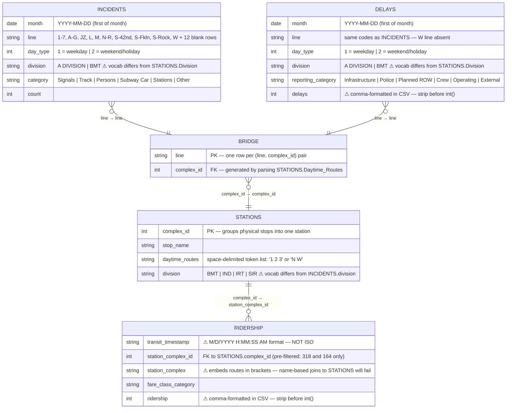

# MTA Data Model — "Transfer of Stress"

> **Status:** Tabs 1–4 describe the **v1 SQLite model** (archived). The active v2 model is a **Postgres star schema** — DDL in `postgres/2_schema.sql`, ETL in `postgres/3_transform.sql`, exports in `postgres/4_export.sql`. The v1 content below is preserved as reference for the data preparation presentation (`DATA_PREP_PRESENTATION.md`).

Five tables, one bridge, three traps.

---

## Tab 1 — Entity-Relationship Diagram



---

## Tab 2 — The Easy Join: Incidents ↔ Delays

These two tables share the same grain and the same three key columns.

| Key | INCIDENTS | DELAYS | Notes |
|-----|-----------|--------|-------|
| `month` | `YYYY-MM-DD` | `YYYY-MM-DD` | ✓ identical format |
| `line` | includes `W` | no `W` | one extra line in Incidents — not a structural problem |
| `day_type` | `1` / `2` | `1` / `2` | ✓ identical coding |

**How to join in Tableau:** relate the two tables on all three keys, or aggregate each to month-level first and then join on `month` only.

Both tables also have a `division` column — it *looks* like a natural third join candidate but **do not use it as a join key to STATIONS** (see Tab 3).

---

## Tab 3 — The Hard Join: Line-Side ↔ Station-Side

Incidents and Delays speak **line language** (`"1"`, `"A"`, `"JZ"`).  
Ridership and Stations speak **complex language** (`318`, `164`).  
There is no shared column between the two halves — you need the bridge table.

### The bridge table solves this

`bridge_line_station.csv` maps every line token to the complex(es) it stops at.  
It is generated by parsing the `Daytime Routes` column in STATIONS, which stores space-delimited token lists.

```
"1 2 3"  →  complex 318 (34 St–Penn Station, IRT side)
"A C E"  →  complex 164 (34 St–Penn Station, IND side)
```

**Join path in Tableau:**
```
INCIDENTS.line  ──►  BRIDGE.line
                          │
                    BRIDGE.complex_id  ──►  STATIONS.complex_id
                                                    │
                                          STATIONS.complex_id  ──►  RIDERSHIP.station_complex_id
```

### Three traps on this join path

| Trap | Detail | Fix |
|------|--------|-----|
| `division` column **not joinable** across the gap | INCIDENTS/DELAYS say `"A DIVISION"` and `"BMT"`; STATIONS says `"IRT"`, `"BMT"`, `"IND"`, `"SIR"`. These describe the same concept in incompatible vocabularies — IRT = A Division. | Ignore `division` for cross-side joins; use the bridge table only. |
| `station_complex` name in RIDERSHIP **embeds route letters** | Value is `"34 St-Penn Station (1,2,3)"` — the bracketed suffix makes it non-matchable to `STATIONS.stop_name`. | Join on `station_complex_id` (integer), not on the name string. |
| **Date format mismatch** | INCIDENTS/DELAYS: `2020-01-01` (ISO). RIDERSHIP: `04/29/2022 01:00:00 PM` (M/D/YYYY, 12-hour). MTA_Final_Dataset: `2020-01-01 00:00:00-05` (ISO + timezone). | In Tableau: right-click each date field → Change Data Type → Date. Tableau will reparse on import. In Python: use `datetime.strptime` with the correct format string for each file. |

---

## Tab 4 — Bridge Table Python Script

Run once from the repo root. Output is already at `datasets/bridge_line_station.csv` — **do not overwrite** without re-applying the JZ fix below.

### JZ fix (already applied — 797 rows)

The stations file stores J and Z as separate tokens in `Daytime Routes`, so the base script produces separate `J` and `Z` rows. But the incidents/delays files use `JZ` as a single combined token — meaning all J/Z incidents would silently drop on any join.

**Fix applied:** 30 `JZ` rows were added as the union of all complexes served by J or Z individually. Bridge table grew from 767 → 797 rows.

If you ever re-run the base script (e.g. after a fresh stations download), re-run this patch immediately after:

```python
import csv

rows = []
jz_complexes = set()

with open('datasets/bridge_line_station.csv', newline='') as f:
    for r in csv.DictReader(f):
        rows.append(r)
        if r['line'] in ('J', 'Z'):
            jz_complexes.add(r['complex_id'])

for cid in sorted(jz_complexes, key=int):
    rows.append({'line': 'JZ', 'complex_id': cid})

rows.sort(key=lambda r: (r['line'], int(r['complex_id'])))

with open('datasets/bridge_line_station.csv', 'w', newline='') as f:
    w = csv.DictWriter(f, fieldnames=['line', 'complex_id'])
    w.writeheader()
    w.writerows(rows)

print(f'Done. Total rows: {len(rows)}')
```

```python
import csv

rows = []
with open('datasets/MTA_Subway_Stations_20260427.csv', newline='', encoding='utf-8') as f:
    for r in csv.DictReader(f):
        for line in str(r['Daytime Routes']).split():
            rows.append((line.strip(), int(r['Complex ID'])))

seen = set()
with open('datasets/bridge_line_station.csv', 'w', newline='') as f:
    w = csv.writer(f)
    w.writerow(['line', 'complex_id'])
    for row in rows:
        if row not in seen:
            seen.add(row)
            w.writerow(row)

print(f"bridge_line_station.csv: {len(seen)} rows written")
```

### Penn Station rows this produces

| line | complex_id |
|------|-----------|
| 1 | 318 |
| 2 | 318 |
| 3 | 318 |
| A | 164 |
| C | 164 |
| E | 164 |

---

## Tableau-ready output files

These files are the end product of all data prep. Load these into Tableau — do not load the raw CSVs directly.

| File | Rows | Grain | Use for |
|------|------|-------|---------|
| `datasets/mta_tableau_joined.csv` | 644 | month × line × day_type × category | Primary source — KPI strip, time series, category bar |
| `datasets/MTA_Final_Dataset.csv` | 60 | month (Penn Station total) | Delay intensity KPIs — relate to joined file on `month` |
| `datasets/mta_hourly_avg.csv` | 24 | hour of day | Hourly scatter sheet (standalone data source) |
| `datasets/mta_dow_totals.csv` | 7 | day of week | Weekday bar sheet (standalone data source) |
| `datasets/mta_station_coords.csv` | 321 | line × station_stop | Map sheet — relate to joined file on `line` |

**Columns in `mta_tableau_joined.csv`:**
`month`, `line`, `line_group`, `day_type`, `category`, `incident_count`, `delays`, `ridership`, `complex_id`, `stop_name`, `latitude`, `longitude`

- `latitude` / `longitude` are Penn Station coordinates only (two distinct points: complex 318 and 164)
- `delays` is summed across all reporting categories for that line/month/day_type
- `ridership` is the monthly total for the whole Penn Station complex
- `line_group` is pre-computed (`"1/2/3"` or `"A/C/E"`) — do not recreate as a calculated field in Tableau

**Note on dropped columns:** `reporting_category` (collapsed into total delays) and `fare_class_category` (collapsed into total ridership) were excluded. Rejoin the raw `delays` or `ridership` tables if you need that breakdown.

---

## Tableau Data Source Setup

**Data Source 1 — "MTA Penn Lines"** (primary, used for all main sheets):

```
mta_tableau_joined.csv   [primary table]
    │ relate on: line
    ▼
mta_station_coords.csv
    
mta_tableau_joined.csv
    │ relate on: month
    ▼
MTA_Final_Dataset.csv
```

Use **Relationships** (logical layer noodle), not Joins, to avoid row fan-out. Rename this source "MTA Penn Lines" in Tableau.

**Data Source 2 — "Hourly Avg":** `mta_hourly_avg.csv` standalone (columns: `hour`, `hour_num`, `avg_ridership`)

**Data Source 3 — "Weekday Totals":** `mta_dow_totals.csv` standalone (columns: `weekday`, `day_num`, `total_ridership`)

**Switching sources in Tableau:** Click the data source name at the top of the Data pane — a dropdown lists all connected sources. Each sheet remembers which source it uses.

---

## Dashboard KPI Formulas (confirmed from Dashboard_Draft.png)

| KPI | Value | Source table | Formula |
|-----|-------|-------------|---------|
| Avg monthly riders | 1.16M | MTA_Final_Dataset | `AVG([ridership])` |
| S+T Incidents total | 353 | mta_tableau_joined | `SUM(Signal+Track Incidents)` |
| Months with >1% delay intensity | 28.3% | MTA_Final_Dataset | `COUNTD(IF [delay_intensity] > 0.01 THEN [month] ELSE NULL END) / COUNTD([month])` |
| Avg time lost (incident months) | 5.2 hrs | MTA_Final_Dataset | `AVG(IF [total_incidents] > 0 THEN [total_delays] ELSE NULL END) / 60` — delays in minutes |

## SQLite database

`mta.db` contains all 7 tables with proper integer types and indexes. Built by `load_to_sqlite.py`.

| Table | Rows |
|-------|------|
| `stations` | 496 |
| `incidents` | 5,594 |
| `delays` | 17,895 |
| `ridership` | 681,767 |
| `ridership_sample` | 500 |
| `bridge` | 797 |
| `final_dataset` | 60 |

Windows copy: `C:\Users\subra\Documents\mta.db` — open in DBeaver.  
Rebuild: `rm mta.db && python3 load_to_sqlite.py`

---

## Quick reference — column formats

| Column | File | Format | Cast needed |
|--------|------|--------|-------------|
| `month` | Incidents, Delays | `YYYY-MM-DD` | Tableau: change to Date |
| `transit_timestamp` | Ridership | `M/D/YYYY H:MM:SS AM` | Tableau: change to Date; extract year+month |
| `month` | MTA_Final_Dataset | `YYYY-MM-DD HH:MM:SS±TZ` | Tableau: change to Date |
| `delays` | Delays | comma-formatted string | Strip `,` before `int()` |
| `ridership` | Ridership | comma-formatted string | Strip `,` before `int()` |
| `line` | Incidents | includes blank rows (12) | Filter `line != ''` in Tableau |
| `JZ` | Incidents | J+Z trains combined | Do not split — treat as one token |
